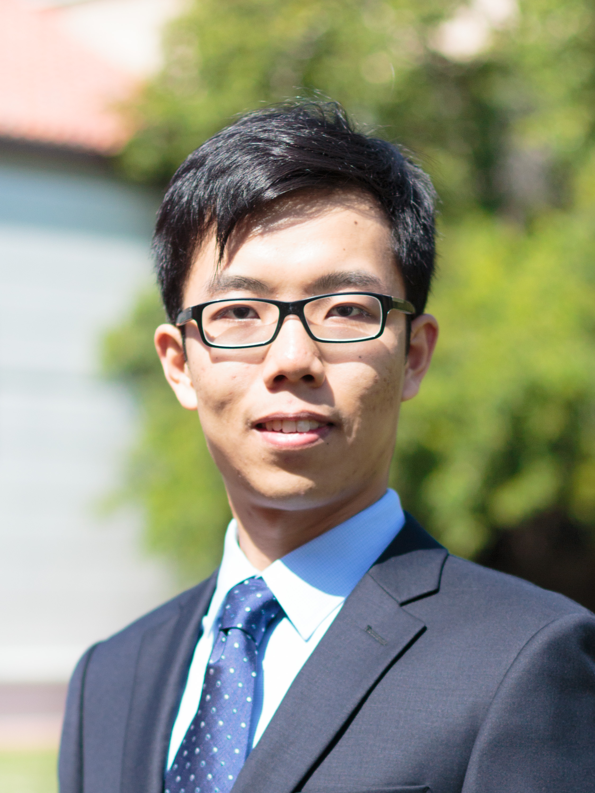

 

I am a second year Ph.D. student in [Biostatistics](http://www.stat.berkeley.edu/biostat) at [UC Berkeley](http://statistics.berkeley.edu/). I am fortunate to be advised by Professors [Mark van der Laan](http://www.stat.berkeley.edu/~laan/) and [Alan Hubbard](http://hubbard.berkeley.edu/). My research interests lie in **Statistical Machine Learning** and **Causal Inference**. 

I graduated from [the Univeristy of Hong Kong](http://hku.hk) with a B.Sc. (Honors) in [Statistics](http://www.saasweb.hku.hk/) and double major in [Finance](http://fbe.hku.hk/). I was awarded the [Saw Gold Medal in Statistics](http://www.saasweb.hku.hk/programme/scholarship.php) (magna cum laude) and [Undergraduate Research Fellowship](http://tl.hku.hk/urfp/) during my graduation at HKU.

Prior to joining UC Berkeley, I was a visiting researcher at [UC Davis](http://www.stat.ucdavis.edu/) working with [Prabir Burman](http://www.stat.ucdavis.edu/~burman/). I also worked under the able guidance of [Prof. Alexander Aue](http://www.stat.ucdavis.edu/~alexaue/) and [Prof. Debashis Paul](http://www.stat.ucdavis.edu/~debashis/).

Here is the latest version of my [CV](link).

 
 

## EDUCATION

- **University of California, Berkeley**, 2015 - present  
*Ph.D. in Biostatistics*

- **The University of Hong Kong**, 2011 - 2015  
*B.Sc. in Statistics*

- **University of California, Davis**, 2013 - 2014  
*Visiting Researcher*

## EXPERIENCE

- **Precision Medicine Researcher**, 2017 - present  
*Bill \& Melinda Gates Foundation*   
<blockquote>Wasting is a lack of growth in terms of weight/height among African children. I applied Targeted Learning to help better curing *individual children*.</blockquote>

- **Data Analyst to President**, 2013   
*China Europe International Business School*  
<blockquote>We are the first Chinese MBA program to integrate cutting-edge Big Data into curriculum.</blockquote>

## SELECTED AWARDS

- **JSM Student Travel Awards, SF Bay Area Chapter of the ASA**, 04/2016 \[[News](http://www.sfasa.org/June7_2016mtg.htm)\] 
*SFASA*

- **Saw Gold Medal in Statistics**, 04/2016  
*University of Hong Kong*

- **Saw See Hock Statistics Scholarship**, 02/2016  
*University of Hong Kong*

- **Undergraduate Research Fellowship & Overseas Research Internship Award**, 01/2014  
*University of Hong Kong*

- **C.V. Starr Scholarship**, 2013  
*University of Hong Kong*

## CONTACT

Email: [wcai [at] berkeley [dot] edu](mailto:wcai@berkeley.edu)  
Office: 101 Haviland Hall, Berkeley  
[Google scholar profile](link)  
[Linkedin](https://www.linkedin.com/in/wilsoncai)