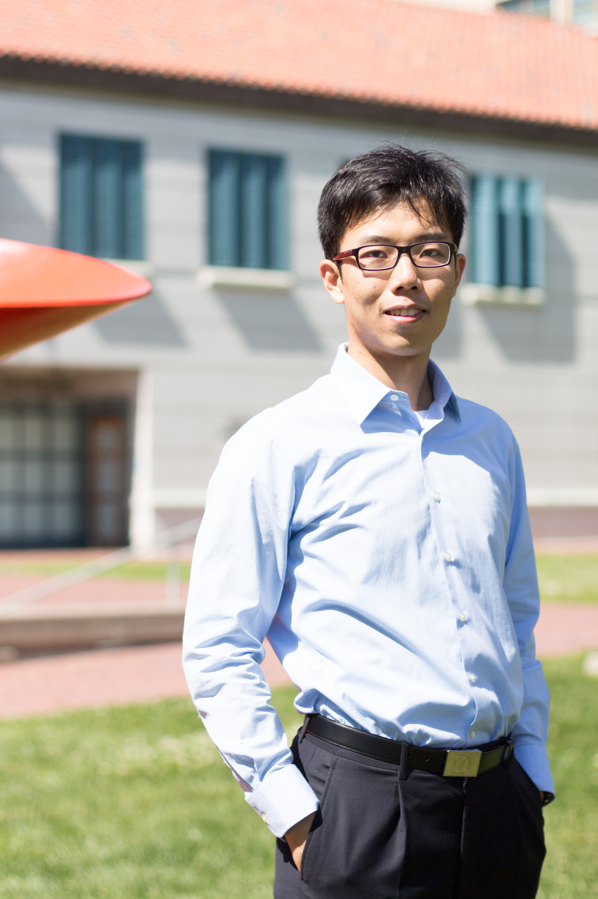

<!--  -->
 
 
 

I am a second year Ph.D. student in [Biostatistics](http://www.stat.berkeley.edu/biostat) at UC Berkeley. I am fortunate to be advised by Professors [Mark van der Laan](http://www.stat.berkeley.edu/~laan/) and [Alan Hubbard](http://hubbard.berkeley.edu/). My research interests lie in **Statistical Machine Learning** and **Causal Inference**. 

Prior to Berkeley, I was a visiting researcher at [UC Davis](http://www.stat.ucdavis.edu/) working with [Prabir Burman](http://www.stat.ucdavis.edu/~burman/). Before that, I obtained a Bachelors (B.Sc.) degree in Statistics and double major in Finance from [the Univeristy of Hong Kong](http://hku.hk).

Here is the latest version of my [CV](link).

 
 
 
 

## EDUCATION

- **University of California, Berkeley**, 2015 - present  
*Ph.D. in Biostatistics*

- **The University of Hong Kong**, 2011 - 2015  
*B.Sc. in Statistics*

- **University of California, Davis**, 2013 - 2014  
*Visiting Researcher*

## EXPERIENCE

## SELECTED AWARDS

- **JSM Student Travel Awards, SF Bay Area Chapter of the ASA**, 04/2016  
*SFASA*

- **Saw Gold Medal in Statistics**, 04/2016  
*University of Hong Kong*

- **Saw See Hock Statistics Scholarship**, 02/2016  
*University of Hong Kong*

- **Undergraduate Research Fellowship & Overseas Research Internship Award**, 01/2014  
*University of Hong Kong*

- **C.V. Starr Scholarship**, 2013  
*University of Hong Kong*

## CONTACT

Email: [wcai [at] berkeley [dot] edu](mailto:wcai@berkeley.edu)  
[Google scholar profile](link)  
[Linkedin](https://www.linkedin.com/in/wilsoncai)